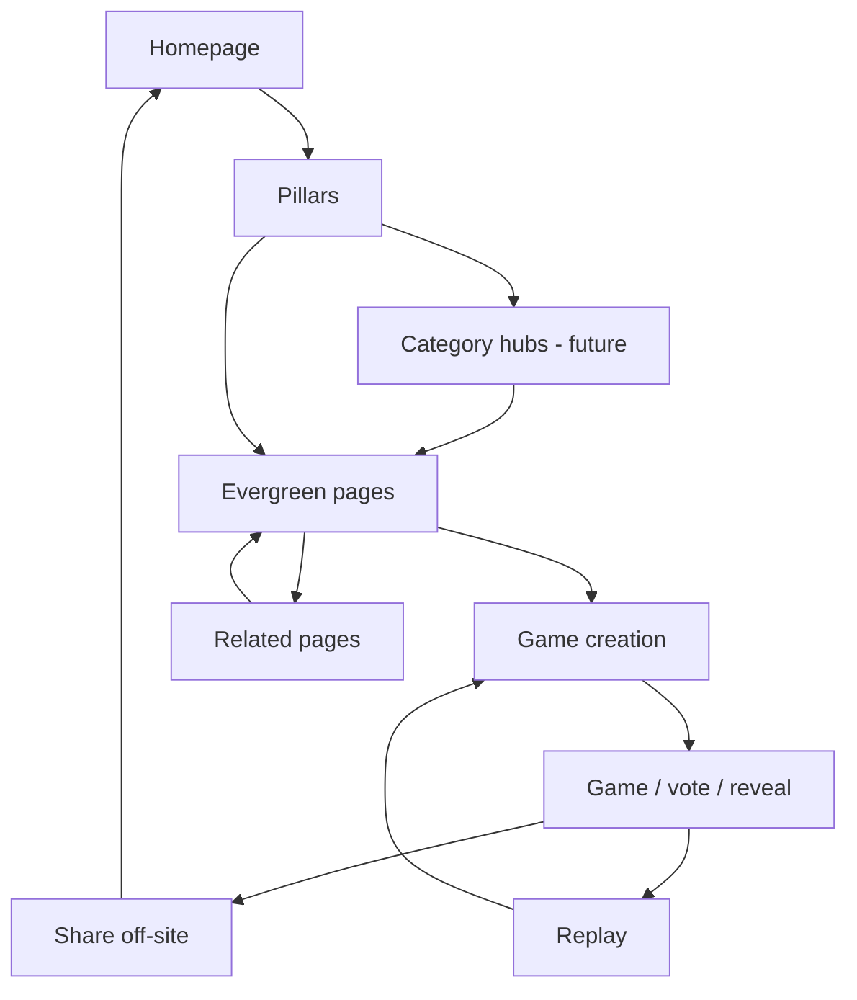

# FriendRank Discovery System

**Version:** 1.0  
**Status:** Internal operating system for organic growth  
**Audience:** Founders, engineers, future AI assistants  
**Last updated:** July 2026  
**Related:** `/docs/PRODUCT_BIBLE.md`, `/docs/AI_CONTEXT.md`

This document describes how FriendRank grows through search, AI assistants, internal linking, evergreen content, social sharing, and product loops. It is not an SEO checklist.

---

## 1. Discovery Philosophy

**Core principle:** FriendRank should be discovered naturally — not pushed through hacks, spam, or one-off campaigns.

Discovery is not a marketing layer bolted onto the product. It is how people find their way from a question (“funny group game for friends”) to a shared moment (create → vote → reveal → share). Every surface should make the next step obvious.

**How growth compounds:**

1. A page ranks or gets cited → visitor lands with intent  
2. Internal links and CTAs route them toward pillars or game creation  
3. A game is created → invite link enters a group chat (off-site distribution)  
4. Results are shared → screenshots and links bring new visitors back into the graph  

Each cycle adds indexed pages, inbound links, brand mentions, and product-led traffic. The system gets stronger when **every page creates opportunities to discover another page** and **every visitor has multiple paths deeper into the product**.

**Discovery is a product feature.** Post-create share UX, reveal output, and replay friction are as important as meta titles. If the product loop is weak, SEO traffic does not stick.

---

## 2. Current Discovery Map

Today’s ecosystem:

```
Homepage
  ↓
Pillar pages (evergreen hubs)
  ↓
Evergreen landing pages (~100+ live)
  ↓
Game creation (homepage #create-game)
  ↓
Invite (share link)
  ↓
Voting (/game/[share_code])
  ↓
Reveal (overlay + results)
  ↓
Share (card, copy text)
  ↓
Replay (manual — weak)
```

### What exists today

| Stage | Status | Notes |
|-------|--------|-------|
| Homepage | **Live** | Hero, create form, pillar discovery, FAQ, reveal preview |
| Pillars | **Live** | 6 primary hubs + supporting cluster pages (e.g. anonymous voting) |
| Evergreen pages | **Live** | Registry-driven; metadata, schema, Related Games |
| Game creation | **Live** | Supabase persistence; GA4 events |
| Invite | **Live** | Copy link, vote now, progress snippet |
| Voting | **Live** | Mobile-first; live progress polling |
| Reveal | **Live** | ~3.2s overlay; narrative results |
| Share | **Live** | Preview, download, copy share text |
| Replay | **Partial** | “Play again” exists; no strong habit loop |

### Strengths

- **Full funnel is shippable** — search visitor can reach game creation in two clicks from most landing pages  
- **Pillar + long-tail coverage** — topical authority without a single homepage directory  
- **Automatic internal linking** — Related Games from Intent Registry + keyword clusters (`lib/landing-pages/internal-links.ts`)  
- **Build-time SEO/GEO audits** — `npm run audit:all` catches canonical, overlap, and structure issues  
- **Growth tooling** — Search Console action plan, CTR candidates, distribution registry (`lib/growth/`)  
- **Product-led off-site loop** — invite links and share cards work outside the website  

### Weaknesses

- **Organic traffic still early** — Search Console baselines need consistent weekly review  
- **Replay underdeveloped** — most groups do not automatically start round two  
- **Uneven long-tail depth** — many pages lack enhanced intros; audit flags `missing_enhanced_intro`  
- **Overlap risk** — similar slugs/titles (singular/plural) need monitoring, not blind expansion  
- **Reveal perception** — still at risk of feeling like “waiting” vs “event” (Phase 22 lesson)  
- **Community distribution manual** — Reddit, Indie Hackers depend on founder cadence  

### Where traffic enters

| Entry | Typical intent |
|-------|----------------|
| **Google Search** | Intent landing pages, pillars, homepage (brand) |
| **Direct / referral** | Game links (`/game/{share_code}`), word of mouth |
| **itch.io launcher** | Browser-game audience → homepage |
| **Reddit / Indie Hackers** | Pillar or landing page links (manual posts) |
| **AI assistants** | Citations to homepage, pillars, or specific guides (emerging) |

Game URLs are **not in the sitemap** — they enter via share, not crawl.

### Where users leave

| Drop-off point | Common cause |
|----------------|--------------|
| Landing page | Weak CTA clarity, bounce before scroll to create |
| Create form | Abandonment mid-form (`game_creation_abandoned`) |
| Post-create | Host does not copy invite link |
| Vote flow | Not enough friends open link; threshold not met |
| Results | No screenshot/share; no replay |

Use **GA4** for funnel events and **Clarity** for session replay on these steps.

---

## 3. Content Graph

**Intended architecture** (current + planned):

```
Homepage
  ↓
Pillars (evergreen hubs)
  ↓
Category hubs (future — mid-layer between pillar and long-tail)
  ↓
Evergreen landing pages
  ↓
Game creation
  ↓
Reveal / results
  ↓
Related pages (on-site)
  ↓
Replay (product loop)
```



### Why this structure works

**Google crawling:** Clear hierarchy (home → pillar → leaf) gives crawlers topical clusters. Internal links spread authority without orphan pages. Sitemap lists indexable URLs; game pages stay out.

**AI understanding:** Each layer has a distinct purpose — brand/conversion (home), category answer (pillar), specific intent (evergreen). GEO layers (`lib/geo/`) add build-time entity and intent metadata so LLMs can summarize confidently.

**Internal authority:** Links flow upward (long-tail → pillar → home) and sideways (cluster siblings). Pillars aggregate many intents without duplicating full content.

**User navigation:** A visitor can enter at any leaf, understand context via pillar links, and always find a path to “create free game.”

**Category hubs (future):** A mid-layer for dense clusters (e.g. “office icebreakers”, “couple quizzes”) between pillar and long-tail — reduces pillar clutter and improves Related Games relevance.

---

## Category Hub Infrastructure (Phase 23)

The category hub framework lives in `lib/discovery/` and `components/discovery/`. It is the reusable architecture for the next 100 mid-layer pages.

### Category Registry

**File:** `lib/discovery/category-registry.ts`

Single source of truth for category hub definitions. Each entry includes:

| Field | Purpose |
|-------|---------|
| `slug` | URL segment under `/categories/{slug}` |
| `title` / `description` | Hub identity |
| `parentPillar` | Links upward to an existing evergreen pillar (e.g. `friend-games`) |
| `primaryKeywords` | Planning and future SEO |
| `relatedCategorySlugs` | Sideways links in the graph |
| `relatedEvergreenSlugs` | Downward links to landing pages |
| `status` | `seed` \| `planned` \| `live` — only `live` hubs get public routes |

Pillar slugs are defined separately in `PILLAR_REGISTRY` and map to existing routes (`/friend-games`, etc.). **Pillar pages are not modified by this layer.**

### Discovery Graph

The graph connects four node types:

```
Pillar (existing evergreen hub)
  ↓ parentPillar
Category hub (/categories/{slug})
  ↓ relatedEvergreenSlugs
Evergreen landing page (/{slug})
  ↓ CTA
Game creation (/#create-game)
```

**Resolver:** `getRelatedContent()` in `lib/discovery/related-content.ts` accepts a context (`pillar`, `category`, or `evergreen`) and returns pillars, categories, evergreen pages, recommended next pages, and the game entry point.

**Utilities:** `getRelatedCategories()`, `getRelatedPages()`, `getSiblingCategories()`, `getParentPillar()`, `getRecommendedNextPage()` in `lib/discovery/discovery-utils.ts`.

### Internal Linking Engine

`RelatedLinks` and `RelatedLinksGroup` (`components/discovery/related-links.tsx`) render discovery arrays without hardcoded page logic. Supports pillars, categories, evergreen pages, game creation, and future profile links (shown as unavailable placeholders).

The landing page Related Games system (`lib/landing-pages/internal-links.ts`) remains unchanged. Category hubs add a **parallel mid-layer** that consumes the Category Registry — future sprints may wire evergreen pages to call `getRelatedContent()` for cross-layer links.

### Category Hub Template

**File:** `components/discovery/category-hub-template.tsx`

Shared layout for every hub:

```
Breadcrumbs (synced with BreadcrumbList schema)
  ↓
Hero
  ↓
Short introduction
  ↓
Use cases / benefits (optional, from content model)
  ↓
Primary related games (deduped; merged heading when no distinct secondary pages)
  ↓
Additional pages (only when distinct from primary games)
  ↓
Related categories (live hubs only)
  ↓
Explore more {parent pillar title}
  ↓
Create Game CTA
  ↓
FAQ
```

**Content model:** `lib/discovery/category-hub-content.ts` supports a short `introduction`, optional `useCases` and `benefits` sections, and `faq`. Category hubs should preserve topical depth but present it through scannable sections rather than one uninterrupted article block.

**Discovery deduplication:** `buildCategoryHubDiscoverySections()` in `lib/discovery/category-hub-discovery.ts` ensures the same URL never appears in both primary games and additional pages, and hides unavailable planned/seed category links from production UI.

### Adding a new hub (two steps)

1. Add one object to `CATEGORY_REGISTRY` with `status: "live"`.
2. Create `app/categories/{slug}/page.tsx`:

```tsx
import type { Metadata } from "next";
import { buildCategoryHubMetadata, CategoryHubPage } from "@/lib/discovery/category-hub-page";

const SLUG = "your-slug";

export const metadata: Metadata = buildCategoryHubMetadata(SLUG);

export default function Page() {
  return <CategoryHubPage slug={SLUG} />;
}
```

3. Add introduction/FAQ to `CATEGORY_HUB_CONTENT` (optional but recommended).

**Example (live):** `/categories/best-friends`, `/categories/coworkers`, `/categories/couples`, `/categories/party-games` — full stack without modifying pillar pages.

### Future hub generation

Later sprints may:

- Register category hubs in sitemap when `status: "live"`
- ~~Wire `getRelatedContent()` into evergreen landing page templates~~ **Done (Sprint 2)**
- Extend route audit to recognize `/categories/*` routes
- Generate hub copy from registry keywords (with editorial guardrails)

### Connected content graph (Phase 23 Sprint 2)

The discovery engine is now wired into public pages:

| Surface | Component | What it shows |
|---------|-----------|---------------|
| **Evergreen landing pages** | `DiscoveryExploreSection` | Parent pillar, related categories, related games, related pages, create-game CTA |
| **Evergreen hub / pillar pages** | `DiscoveryExploreSection` + `PillarExploreMoreSection` | Games, pages, CTA; live category hubs on pillars |
| **Category hub pages** | `CategoryHubTemplate` | Registry-driven links (Sprint 1) |

**Recommendation order** (`getOrderedRecommendations`):

```
Current page (excluded from links)
  ↓
Sibling pages (registry + internal-links fallback)
  ↓
Parent pillar
  ↓
Related categories
  ↓
Related games (registry evergreen slugs)
  ↓
Game creation (/#create-game)
```

**Slug resolver:** `getRelatedContentForSlug()` handles landing pages, pillars, category hubs, and supplemental evergreen hubs (via `EVERGREEN_HUB_PARENT_PILLAR` map).

**Deduplication:** `lib/discovery/link-utils.ts` prevents duplicate links within discovery sections. Landing pages pass existing `relatedPages` slugs as exclusions.

**Build-time validation:** `validateCategoryRegistry()` in `npm run audit:all` ensures every **live** category has a parent pillar, at least one related evergreen page, and a game CTA.

---

## 4. Internal Linking System

Internal linking is the **primary on-site compounding mechanism**. It is registry-driven, not hand-maintained per page.

### Principles

Every page should **naturally** offer paths to:

- Related categories (same keyword cluster)  
- Parent or sibling **pillars**  
- Related **landing pages** (live + planned “Coming Soon”)  
- **Game creation** (homepage `#create-game` or equivalent CTA)  
- **Results / product proof** (reveal preview, social proof sections)  
- Future **category hubs** (when they exist)  

**Never force links.** If a link does not help the reader, omit it. Contextual beats comprehensive.

### How linking works today

`getRelatedLandingPageItems()` assembles Related Games in tiers:

1. Same-cluster live pages (closest intent)  
2. Overlapping-cluster live pages  
3. Popular live fallbacks (when cluster is sparse)  
4. Planned high-priority pages (Coming Soon)  

Membership comes from **Intent Registry** + **Keyword Clusters** — one source of truth. When a planned page goes live, links update automatically.

Pillar pages link down to featured guides and category cards. Homepage discovery cards link to pillars and exemplar landing pages.

### Authority flow

```
Homepage (brand + conversion authority)
    ↑↓
Pillars (topical authority)
    ↑↓
Evergreen pages (long-tail capture)
    → Game creation (conversion)
```

**Sideways links** between evergreen siblings prevent silos. **Upward links** (breadcrumb-style, “browse friend games”) reinforce pillar strength.

### Why this compounds

Each new live page strengthens its cluster neighbors. Each pillar accumulates more inbound links as long-tail pages ship. Google and AI systems see a coherent graph, not 100 disconnected doorways. Over time, **ranking one page lifts related pages** — if overlap is managed.

---

## 5. Google SEO

**Strategy in one sentence:** Build topical authority with pillars, capture intent with evergreen pages, convert with a fast product — and never sacrifice UX for rankings.

### Current approach

| Layer | Implementation |
|-------|----------------|
| **Pillars first** | Ship and strengthen hubs before spraying low-intent URLs |
| **Evergreen content** | Intent Registry; live pages with FAQ, benefits, schema |
| **Structured metadata** | Titles, descriptions, canonical, JSON-LD per page |
| **Semantic HTML** | Headings, sections, accessible structure |
| **Internal links** | Automatic Related Games + pillar navigation |
| **Performance** | Next.js static generation; selective code-splitting on homepage |
| **Search intent** | One primary intent per URL; clusters define membership |

**Operational rhythm:** Weekly Search Console review → max 3 actions → `npm run audit:all` before deploy. CTR rewrites only when impressions exist and CTR is weak (`lib/growth/ctr-optimization.ts`).

### What should never happen

- **Keyword stuffing** — in copy, titles, or hidden text  
- **Doorway pages** — thin URLs that only exist to rank and redirect  
- **Duplicate content** — same intent answered by multiple live URLs without differentiation  
- **AI-generated fluff** — pages with no product connection or user value  
- **Metadata churn without data** — rewriting titles before Search Console baseline  
- **Sitemap bloat** — indexing game sessions or utility URLs  

SEO serves the product loop. If a page would not help someone start a game, do not ship it.

---

## 6. AI Discoverability (GEO)

AI-assisted search (ChatGPT, Gemini, Perplexity, Copilot, etc.) rewards pages that are **easy to summarize and cite**. FriendRank prepares for this at build time via GEO (`lib/geo/`) — not runtime LLM features.

### How to be AI-readable

- **Clear hierarchy** — home → pillar → leaf; obvious page type  
- **Clear page purpose** — what the user can do here (learn, compare, create)  
- **Consistent terminology** — “social voting game”, “friend group”, “anonymous voting”, same across docs and UI  
- **Question-oriented headings** — FAQ and H2s match how people ask assistants  
- **Structured content** — sections, lists, comparison tables on pillars  
- **Helpful answers** — substantive FAQ, not filler  
- **Context before promotion** — explain the use case, then CTA to create  

`public/about-friendrank.md` and `/docs/AI_CONTEXT.md` support external citation. Assembled pages include `geoFoundation` and AI citation layers internally.

### Strategic shift

**AI citation is becoming as valuable as traditional rankings** for discovery queries (“what’s a good icebreaker for a small team?”). A cited answer sends qualified visitors with higher intent than generic SERP clicks.

GEO does not replace SEO. Both read the same public content. Good architecture serves both.

---

## 7. Distribution Channels

Every channel should reconnect to the **content graph** or **product loop** — not dead-end traffic.

| Channel | Role | Re-entry point |
|---------|------|----------------|
| **Google Search** | Primary organic | Landing page or pillar → create |
| **AI assistants** | Emerging organic | Pillar, guide, or about page → create |
| **Reddit** | Community discovery | Authentic posts linking to relevant pillar/page |
| **Indie Hackers** | Builder / early-adopter audience | Product story → homepage |
| **Direct sharing** | Brand, bookmarks | Homepage |
| **Friend invites** | Core viral loop | `/game/{share_code}` → vote → results |
| **Social posts** | Pinterest, LinkedIn (manual) | Pillar or occasion landing page |
| **itch.io** | Browser-game directories | Launcher → homepage |
| **Future creators** | UGC, streamers, teachers | Deep links to intent pages or games |
| **Future backlinks** | Authority sites | Pillar or resource landing pages |

**Registry:** `lib/growth/distribution-opportunities.ts` maps page types to channels with effort, risk, and spam-avoidance rules. **No auto-posting.**

Off-site invite and share links are the highest-quality traffic — they arrive with social context and a ready-made group.

---

## 8. Shareability System

Product quality creates distribution. Marketing cannot fix a result nobody wants to screenshot.

### Product-driven growth levers

| Lever | Today | Future opportunity |
|-------|-------|-------------------|
| **Reveal / results** | Narrative cards, ending highlight | Stronger “moment” copy; clearer climax |
| **Funny / emotional output** | Tone + vibe-driven narrative | More share-optimized one-liners |
| **Invite flow** | Copy link, vote progress | Remind host when votes stall |
| **Replay flow** | Manual play again | Same group, one-tap rematch |
| **Profile pages** | Not built | Public host history (optional, privacy-first) |
| **Public result examples** | Not built | Sanitized demo results for SEO/social proof |

### Why product quality = distribution

When results are funny, surprising, or debate-starting, the group shares them in iMessage, Discord, or Instagram stories. That share is:

- Free acquisition  
- High-trust referral  
- Off-site link back to FriendRank or a new game URL  

Share events in GA4: `share_card_previewed`, `share_card_downloaded`, `copy_share_text`, `invite_link_copied`.

**Optimize the artifact** (what gets screenshot) before optimizing ad copy.

---

## 9. Success Metrics

Product funnel — qualitative goals, not numeric KPIs:

```
Visitor
  ↓
Landing page (or pillar / homepage)
  ↓
Game creation
  ↓
Invite copied
  ↓
Votes started
  ↓
Reveal completed
  ↓
Results shared
  ↓
Replay
```

| Stage | Goal | Why it matters | Future optimization |
|-------|------|----------------|---------------------|
| **Visitor** | Arrive with clear intent | Wrong intent wastes crawl and trust | Search Console query-page mapping |
| **Landing page** | Understand fit + find CTA | Bounce here kills SEO ROI | Enhanced intros, pillar context links |
| **Game creation** | Complete form | Core conversion | Form UX, Clarity drop-off analysis |
| **Invite copied** | Host shares link | Activates multiplayer loop | Post-create panel, reminders |
| **Votes started** | ≥2 friends vote | Without votes, no reveal | Invite copy, progress visibility |
| **Reveal completed** | Group sees results | Payoff for all participants | Reveal pacing, readability |
| **Results shared** | Screenshot or link out | Off-site acquisition | Share card design, default share text |
| **Replay** | Same group plays again | Retention without new SEO | One-tap rematch, saved groups |

**GA4 events map to this funnel:** `cta_clicked` → `game_creation_started` → `game_created` → `invite_link_copied` → `vote_submitted` → `results_unlocked` → share events.

Measure behavior before optimizing conversion. Do not invent targets without baseline data.

---

## 10. Current Priorities

Ordered for the current maturity stage (product works; acquisition needs compounding):

1. **Protect homepage quality** — Freeze unless GA4/Clarity show create/share drop-off  
2. **Strengthen internal linking** — Pillar ↔ landing ↔ homepage; fix sparse clusters  
3. **Create category hubs** — Mid-layer for dense clusters (future sprint)  
4. **Expand evergreen content** — Ship planned registry intents with pillar coverage first  
5. **Improve discoverability** — Search Console cadence, GEO consistency, AI-readable copy  
6. **Increase shareability** — Results artifact and share text before new features  
7. **Measure behaviour** — Weekly Search Console + GA4; Clarity on create/vote/reveal  
8. **Optimize conversion** — CTR and CTA tweaks only after impressions exist  

**Why acquisition now beats feature sprawl:** The core loop ships. Additional features without traffic or replay data add maintenance and regression risk (see Clarity replay lesson). Compounding discovery + share loops yields more learning per engineering hour than net-new product surface area.

---

## 11. What Not To Do

Anti-patterns that break the discovery system:

| Anti-pattern | Why it fails |
|--------------|--------------|
| **Chase keywords** | Pages without intent fit become doorways |
| **Publish thin pages** | Hurts crawl budget and brand trust |
| **Sacrifice UX for SEO** | Traffic that bounces does not create games |
| **Over-engineer** | Parallel hub systems, custom link lists per page |
| **Add features without measurable value** | No hypothesis → no learning |
| **Create pages only for traffic** | No path to create = wasted index |
| **Optimize before data exists** | Title/meta churn without Search Console baseline |
| **Auto-post to communities** | Spam risk, account bans |
| **Break Clarity replay** | Cannot diagnose UX regressions |
| **Ignore overlap warnings** | Cannibalization between sibling URLs |

**Product Bible rule:** *If an improvement is not clearly better, revert or stop.*

When a sprint increases complexity without improving funnel perception or discovery signals, roll it back and document why.

---

## 12. Future Evolution

Possible additions — **not commitments**. Evaluate each against funnel impact and maintenance cost.

| Direction | Purpose |
|-----------|---------|
| **Category hubs** | Mid-layer navigation — **framework live** (`lib/discovery/`); live hubs: `/categories/best-friends`, `/categories/coworkers`, `/categories/couples`, `/categories/party-games` |
| **AI-generated recommendation pages** | “Best game for X occasion” — only with editorial guardrails |
| **Public profile pages** | Host history, optional social proof |
| **FriendRank collections** | Curated game templates by occasion |
| **Seasonal landing pages** | Holiday, back-to-school — tied to registry |
| **Localization / languages** | New markets after English loop proven |
| **Authority building** | Teacher, HR, party blogger backlinks |
| **Creator ecosystem** | Streamers, teachers embedding or linking games |

Discovery Blueprint (separate doc, planned) will map homepage → pillars → hubs → leaves when category hubs ship.

---

## Operating Commands

```bash
npm run audit:all              # SEO / content integrity
npm run growth:priorities      # Priority URL list
npm run growth:search-console-plan
npm run growth:assistant       # Weekly unified report
npm run growth:distribution    # Channel matching
npm run build
```

---

## Cross-References

- **Product strategy & decisions:** `/docs/PRODUCT_BIBLE.md`  
- **AI onboarding (short):** `/docs/AI_CONTEXT.md`  
- **Growth playbook:** `lib/growth/README.md`  
- **GEO layer:** `lib/geo/README.md`  
- **Landing page planning:** `lib/landing-pages/planning/README.md`  
- **External product summary:** `public/about-friendrank.md`  

---

**FriendRank Discovery System v1.0**
